Backend Development
1. Definition

Backend development is the part of a web application that runs on the server, behind the scenes. The user never sees it, but it makes the application work. It receives requests from the client, applies the business logic, talks to the database, and sends back a response.

If a website is a restaurant, the frontend is the dining area and menu. The backend is the kitchen: it takes the order, cooks it, and sends it out.

2. Main components of the backend
Server: a computer or program that listens for requests and sends responses (for example, Node.js with Express).
Application logic: the code that decides what to do with a request, such as validating a login, calculating a bill or processing an order.
Database: permanent storage for data such as users, products and orders (MySQL, MongoDB, PostgreSQL).
APIs: the interface through which the client and server communicate, usually with HTTP methods like GET, POST, PUT and DELETE.
Authentication and security: login, sessions or tokens, password hashing, and access control.
3. Web application architecture (three-tier)

A web application is divided into layers so that each part has one job. The diagram above shows the flow.

Client (presentation tier): the browser or mobile app. It shows the user interface and sends HTTP requests (for example, a login form submission).

Web server: receives the incoming HTTP request, handles routing, and forwards it to the application. It can also serve static files such as HTML, CSS and images.

Application layer (logic tier): the core of the backend, written in Node.js/Express. It:

processes the request,
applies business rules and validation,
asks the database for data or saves data,
prepares the response.

Database (data tier): stores data permanently. It runs the query sent by the application layer and returns the result.

4. Working (request–response cycle) 
   
The user performs an action in the browser, for example clicking "Login".
The client sends an HTTP request to the web server.
The web server forwards it to the application layer.
The application layer validates the input and sends a query to the database.
The database returns the matching data.
The application layer builds the response (HTML or JSON).
The response travels back through the web server to the client, and the browser displays it.
6. Advantages of layered architecture
Separation of concerns: each layer has one clear responsibility.
Scalability: each layer can be scaled independently.
Security: the client never accesses the database directly.
Maintainability: one layer can be changed without rewriting the others.
Reusability: the same backend can serve a website and a mobile app.

--------------------------------------------------------------------------------------------------------------------------------------------------------------------------------------------------------------------

2Q)Write an express dot JS application to handle GET POST PUT and DELETE request for student information,(8marks )
// server.js
// Express application to handle GET, POST, PUT and DELETE for student information

const express = require('express');
const app = express();

// Middleware: lets Express read JSON data sent in the request body
app.use(express.json());

// In-memory data (acts like a small database)
let students = [
  { id: 1, name: 'Ravi', branch: 'CSE', year: 2 },
  { id: 2, name: 'Sita', branch: 'ECE', year: 2 }
];

// GET /students -> read all students
app.get('/students', (req, res) => {
  res.status(200).json(students);
});

// GET /students/:id -> read one student
app.get('/students/:id', (req, res) => {
  const student = students.find(s => s.id === parseInt(req.params.id));
  if (!student) {
    return res.status(404).json({ message: 'Student not found' });
  }
  res.status(200).json(student);
});

// POST /students -> create a new student
app.post('/students', (req, res) => {
  const { name, branch, year } = req.body;
  if (!name || !branch || !year) {
    return res.status(400).json({ message: 'name, branch and year are required' });
  }
  const newStudent = {
    id: students.length ? students[students.length - 1].id + 1 : 1,
    name,
    branch,
    year
  };
  students.push(newStudent);
  res.status(201).json(newStudent);
});

// PUT /students/:id -> update an existing student
app.put('/students/:id', (req, res) => {
  const student = students.find(s => s.id === parseInt(req.params.id));
  if (!student) {
    return res.status(404).json({ message: 'Student not found' });
  }
  const { name, branch, year } = req.body;
  if (name) student.name = name;
  if (branch) student.branch = branch;
  if (year) student.year = year;
  res.status(200).json(student);
});

// DELETE /students/:id -> remove a student
app.delete('/students/:id', (req, res) => {
  const index = students.findIndex(s => s.id === parseInt(req.params.id));
  if (index === -1) {
    return res.status(404).json({ message: 'Student not found' });
  }
  const removed = students.splice(index, 1);
  res.status(200).json({ message: 'Student deleted', student: removed[0] });
});

// Start the server
const PORT = 3000;
app.listen(PORT, () => {
  console.log(`Server running on http://localhost:${PORT}`);
});
-------------------------------------------------------------------------------------------------------------------------------------------------------------------------------------------------------------------

3Q))**Compare front end and back end development based on architecture ,technologies  Responsibilities ,scalability, and security(8m)**

**Front End vs Back End Development
Introduction**

Front end development builds the part of a web application that the user sees and interacts with (the client side). Back end development builds the part that runs on the server, handling logic, data and security (the server side). Both must work together for a complete application.

**Comparison table**:-

**Key point**

The front end communicates with the back end through APIs, using HTTP requests (GET, POST, PUT, DELETE), and the back end sends the response back as JSON or HTML. Example: when a user logs in, the front end takes the username and password, and the back end checks them against the database.
-----------------------------------------------------------------------------------------------------------------------------------------------------------------------------------------------------------------

4Q00Explain the client server architecture and describe the complete request response cycle in a web application(8m)

**Client-Server Architecture and the Request-Response Cycle
1. Client-server architecture**

**Definition**: Client-server architecture is a model in which work is divided between two parties. 
            The client requests services or data, and the server provides them. They communicate over a network using a protocol such as HTTP.

**Client**: the browser or mobile app. It presents the user interface, takes user input and sends requests.

**Server**: a program running on a powerful machine. It listens for requests, processes them (with the application logic and database) and sends back responses.

+----------+   1. HTTP Request    +-------------+   3. Query     +------------+
|          | -------------------> |  Web Server |  ------------> |            |
|  CLIENT  |                      |      +      |                |  DATABASE  |
| (Browser)|   6. HTTP Response   | Application |   4. Data      |            |
|          | <------------------- |    Layer    | <------------  |            |
+----------+                      +-------------+                +------------+
                                   2. Process request
                                   5. Build response

**Characteristics**

One server serves many clients at the same time.
The client always starts the communication, and the server only responds.
HTTP is stateless: each request is independent.
Data and logic are kept centrally on the server.

**Advantages**

Centralized data, so it is easier to manage and secure.
Easy to update, since only the server needs to change.
The server side can scale independently.
Clients can be any device (browser, phone).
2. **The complete request-response cycle**

Example: a user opens www.example.com/students and the server returns the student list.

**User action**: the user types a URL or clicks a link in the browser.
**DNS lookup**: the browser converts the domain name (example.com) into the server's IP address using a DNS server.
**Connection setup**: the browser opens a TCP connection to the server. For HTTPS, a TLS handshake also happens so the data is encrypted.
**HTTP request sent**: the browser sends a request made of:
a request line (method, URL, e.g. GET /students),
headers (host, content type, cookies),
a body (only for POST and PUT, such as JSON data).
**Server receives the request**: the web server accepts it and passes it to the application (Express).
**Routing:** Express matches the method and URL to the correct route handler, for example app.get('/students', ...).
**Processing**:the application layer validates the input, applies the business logic, and, if data is needed, sends a query to the database.
**Database response:** the database runs the query and returns the data to the application.
**Response created:** the server builds the HTTP response:
a status line (status code, e.g. 200 OK),
headers (content type),
a body (HTML or JSON).
**Response sent back**: the response travels over the network to the client.
**Rendering**: the browser reads the response and displays the page or data to the user. The connection is then closed or reused.

**3. Common HTTP status codes
Code	Meaning
200	OK (success)
201	Created (after POST)
400	Bad request (invalid input)
404	Not found
500	Internal server error**
                                   
--------------------------------------------------------------------------------------------------------------------------------------------------------------------------------------------------------------
**5Q))Discuss the role of back end development in modern web application with suitable real time  examples(8m)**

**Role of Back End Development in Modern Web Applications
Introduction**

In a modern web application, the front end is what the user sees, but the back end is what makes the application actually work. It runs on the server and is responsible for processing requests, managing data, enforcing rules and keeping the system secure. Without the back end, a website would be a static page that cannot log users in, store data or process payments.

**Key roles of back end development**

1**Request processing and business logic**
The back end receives requests from the client, decides what to do with them, and applies the rules of the application, such as checking stock, calculating a bill or applying a discount.

2. **Data management (database handling)**
It stores, retrieves, updates and deletes data (CRUD operations) using databases such as MySQL or MongoDB, and keeps the data consistent and organized.

3. **Authentication and authorization**
It verifies who the user is (login, OTP, tokens) and controls what the user is allowed to access (for example, a normal user versus an admin).

4. **API development**
It provides APIs (REST or GraphQL) through which web apps, mobile apps and other services communicate with the server, usually in JSON format.

5. **Security**
It protects data and the system through password hashing, HTTPS, input validation, and defenses against attacks such as SQL injection.

6. T**hird-party integration**
It connects the application with external services such as payment gateways, SMS and email services, maps and cloud storage.

7. **Performance and scalability**
It handles thousands or millions of users through caching, load balancing, multiple servers and database optimization.

8. **Real-time communication**
It supports instant updates using technologies like WebSockets, so that data reaches users without refreshing the page.

**Real-time examples**
Application	Role of the back end
Amazon / Flipkart (e-commerce)	Stores product and user data, checks stock, manages the cart, processes orders, connects to payment gateways and sends order confirmations
PhonePe / Google Pay (UPI payments)	Authenticates the user, verifies the balance, processes the transaction securely, updates the database and sends an SMS/notification
WhatsApp (messaging)	Receives and delivers messages instantly using real-time connections, stores messages and manages user accounts
Netflix / YouTube (streaming)	Manages user accounts and subscriptions, recommends videos, and serves video files to millions of users using servers and caching
Ola / Uber (ride booking)	Tracks live locations, matches riders with drivers, calculates fare and handles payments
College portal	Handles student login, stores marks and attendance in the database, and lets teachers and students see different data

**Detailed example: online shopping (Flipkart)
1)The user logs in, and the back end verifies the credentials and starts a session.
2)The user searches for a product, and the back end queries the database and returns the results.
3)The user places an order, and the back end checks stock and calculates the total.
4)The payment is sent to the payment gateway, and the back end confirms the result.
5)The order is saved in the database, the stock is reduced, and a confirmation message is sent.**

Each step is handled entirely by the back end. The front end only shows the results.

**Conclusion**

The back end is the backbone of every modern web application. It ensures that the application is functional, secure, fast and able to grow with the number of users.

----------------------------------------------------------------------------------------------------------------------------------------------------------------------------------------------------------------

6Q))**Explain the MVC architecture used in express.Js applications with a suitable example(8 marks)**
MVC Architecture in Express.js
1. Introduction

MVC (Model-View-Controller) is a design pattern that divides an application into three connected parts, so that each part has one clear responsibility. This makes the code organized, easy to maintain and easy to test. Express.js does not force MVC, but it is widely used to structure Express applications.

2. The three components

Model (data)

Manages the data and the rules for handling it.
Communicates with the database (or, in a simple example, an array).
Example: the student model that stores, fetches and adds students.

View (presentation)

What the user sees: the output of the application.
In a web page app, the view is an HTML template (EJS, Pug, Handlebars).
In a REST API, the view is the JSON response sent to the client.

Controller (logic)

The link between the Model and the View.
Receives the request, calls the Model for data, and sends the response.
Contains the application logic (validation, decisions, status codes).

Express adds Routes, which map each URL and HTTP method to a controller function. Routes are not one of the three letters in MVC, but they are part of every Express MVC project.

3. Diagram (flow of a request)
                 1. Request
   +--------+  ------------->  +-----------+  2. Calls   +-----------+
   | CLIENT |                  |  ROUTES   |  ---------> | CONTROLLER|
   |        |                  +-----------+             +-----------+
   |        |                                               |     ^
   |        |                                   3. Asks for |     | 4. Returns
   |        |                                      data     v     | data
   |        |                                            +-----------+
   |        |                                            |   MODEL   |
   |        |                                            | (Database)|
   |        |                                            +-----------+
   |        |   6. Response (View: JSON/HTML)
   |        |  <-------------------------------------  5. Controller builds
   +--------+                                              the response

   Working of the example

**When the client sends GET /students:**

1)app.js sends the request to studentRoutes.js (because of /students).
2)The route calls getAllStudents in the controller.
3)The controller asks the Model for the data with Student.getAll().
4)The Model returns the array.
5)The controller sends it back as a JSON response (the View).

**Advantages of MVC**
**Separation of concerns**: data, logic and presentation are kept apart.
**Easy maintenance:** a change in one part (for example, switching the database) does not break the others.
**Reusability:** the same model can be used by many controllers.
**Teamwork:** different developers can work on the model, view and controller at the same time.
**Easy testing:** each part can be tested independently.
